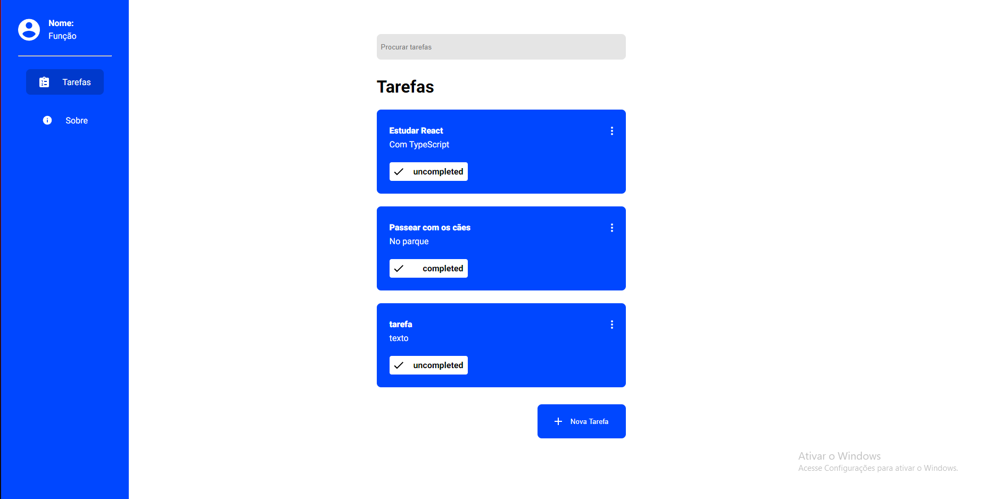
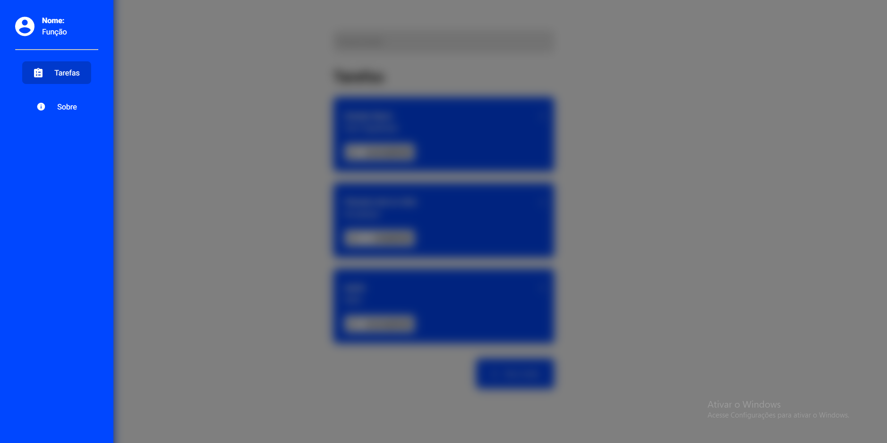
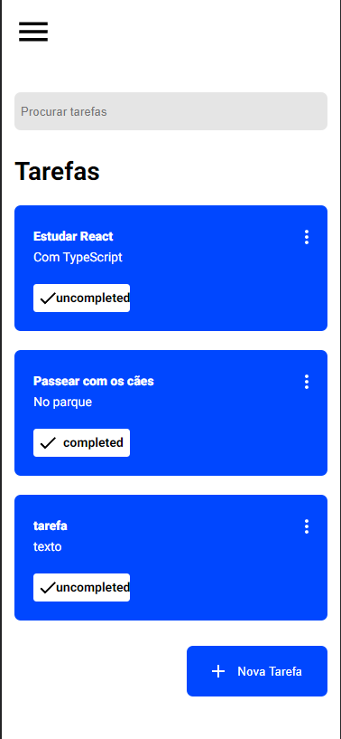
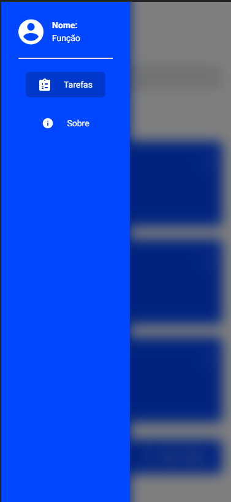

# Teste Wls
Projeto feito para o projeto seletivo da Wls Soluções.
O site consiste numa to-do list, aonde o usuário pode listar,criar,editar e remover suas tarefas.

## Tecnologias usadas
Front-End:
- [x] React(TypeScript)
- [x] NextJS
- [x] Axios

## Instruções
### Primeiros passos:

Depois de baixar o arquivo no [GitHub](https://github.com/ThomasDixini/Teste-Wls.git) no seu terminal, execute o seguinte comando na pasta raiz:

`yarn install`

Após o primeiro passo, rode o comando no terminal para iniciar o projeto:

`yarn start`

Depois disso, o projeto ja estará rodando no seu navegador.

## Desafios/Problemas

    Um dos maiores desafios que tive nesse projeto foi aplicar a responsividade, e fazer diferentes telas para cada tipo de dispositivo. Não ficou 100% perfeito, mas acho
que deu para pelo menos visualizar em Desktop e Mobile.
    Outro desafio que também tive, foi ao tentar aplicar a tecnologia redux. Tentei implementa-lo na aplicação, mas é uma tecnologia que eu não compreendo ainda muito bem,
mas daria para aprender com certeza, só que como o prazo era de 1 semana, resolvi usar a ContextAPI do react mesmo para compartilhar os estados.
    E o maior problema que tive foi fazer as requisições com a API. Consegui fazer com que o site criasse as tasks, mas por algum motivo só aparecia depois que eu recarregava
a página e tentei de tudo para resolver isso, mas infelizmente eu não consegui. E para realizar a edição da tarefa também estava dando o erro de Bad Request que também não
consegui solucionar, pesquisei videos, documentações, etc ... e não consegui tirar esse erro.

## Layouts

